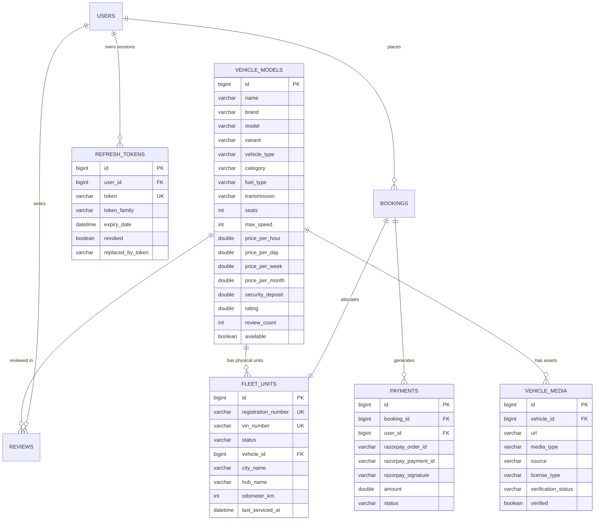

# TBH — MySQL 8.x Production Database Guide

## 1. Overview & Connection Parameters
The TBH Mobility Platform is configured to run on **MySQL 8.x** as the single authoritative persistence store. All legacy H2 and PostgreSQL paths have been removed from the primary production application profile.

| Parameter | Value | Description |
|---|---|---|
| **RDBMS Engine** | MySQL Community Server 8.0.46 | Windows Service `hkt` |
| **Host** | `127.0.0.1` / `localhost` | Local TCP Loopback |
| **Port** | `3306` | Default MySQL Port |
| **Database Name** | `tbh` | Character Set `utf8mb4`, Collation `utf8mb4_unicode_ci` |
| **Default User** | `root` | Production Root User |
| **Connection URL** | `jdbc:mysql://localhost:3306/tbh?useSSL=false&serverTimezone=Asia/Kolkata&allowPublicKeyRetrieval=true` | Configured in `backend/src/main/resources/application.yml` |
| **Connection Pool** | HikariCP | `maximum-pool-size: 10`, `minimum-idle: 5` |

---

## 2. Relational Schema Architecture



---

## 3. Database Initialization & Schema Generation
The backend uses Spring Data JPA with Hibernate `ddl-auto: update`:
- `cities` and `location_hubs` tables populated by `DataInitializer.java`
- `vehicles` (catalog models) populated with 41 authentic models
- `fleet_units` populated with physical registration numbers (`TS-09-TBH-xxx`, `KA-01-TBH-xxx`)
- `vehicle_media` populated with local photo paths and license metadata
- `users` seeded with administrator (`admin@tbhrentals.in`) and rider (`rider@tbhrentals.in`)

---

## 4. Verification Queries

### Verify Table Creation
```sql
USE tbh;
SHOW TABLES;
```

### Verify Fleet Models & Inventory Counts
```sql
SELECT 
    v.id, 
    v.name, 
    v.category, 
    v.price_per_day AS day_rate_inr, 
    COUNT(f.id) AS active_units
FROM vehicles v
LEFT JOIN fleet_units f ON v.id = f.vehicle_id AND f.status = 'AVAILABLE'
GROUP BY v.id, v.name, v.category, v.price_per_day
ORDER BY v.id;
```

### Verify Media Provenance & Licensing Flags
```sql
SELECT 
    v.name,
    m.media_type,
    m.source,
    m.license_type,
    m.verification_status,
    m.verified
FROM vehicle_media m
JOIN vehicles v ON m.vehicle_id = v.id;
```

### Check Refresh Token Sessions
```sql
SELECT 
    r.id, 
    u.email, 
    r.token_family, 
    r.revoked, 
    r.expiry_date
FROM refresh_tokens r
JOIN users u ON r.user_id = u.id;
```

### Check Payment Ledger
```sql
SELECT 
    p.id, 
    p.razorpay_order_id, 
    p.razorpay_payment_id, 
    p.amount, 
    p.status, 
    p.created_at
FROM payments p;
```
