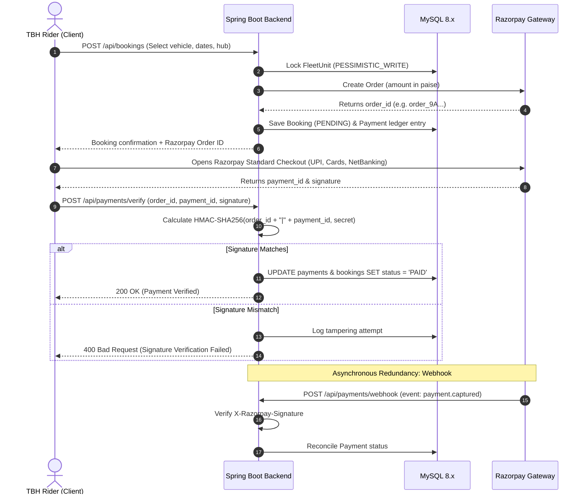

# TBH — Razorpay Payment Gateway Guide

## 1. Architecture & Flow Overview



---

## 2. Configuration Parameters
In `.env` and `application.yml`:
```yaml
tbh:
  payment:
    provider: ${PAYMENT_PROVIDER:razorpay} # 'razorpay' for production or 'mock' for local offline testing
  razorpay:
    key-id: ${RAZORPAY_KEY_ID:rzp_test_YOUR_KEY_HERE}
    key-secret: ${RAZORPAY_KEY_SECRET:YOUR_SECRET_HERE}
    webhook-secret: ${RAZORPAY_WEBHOOK_SECRET:YOUR_WEBHOOK_SECRET_HERE}
```

---

## 3. Endpoints

### Create Payment Order
`POST /api/payments/create-order/{bookingReference}`
- Generates Razorpay order via Razorpay SDK / API
- Records `Payment` entry with status `PENDING`

### Verify Payment Signature
`POST /api/payments/verify`
```json
{
  "bookingReference": "TBH-HYD-A7B29C",
  "razorpayOrderId": "order_NX78x2yza",
  "razorpayPaymentId": "pay_NX79p0abc",
  "razorpaySignature": "2f47c...9a"
}
```

### Razorpay Webhook
`POST /api/payments/webhook`
- Header: `X-Razorpay-Signature: <hex_hmac>`
- Events Handled:
  - `order.paid`
  - `payment.captured`
  - `payment.failed`
